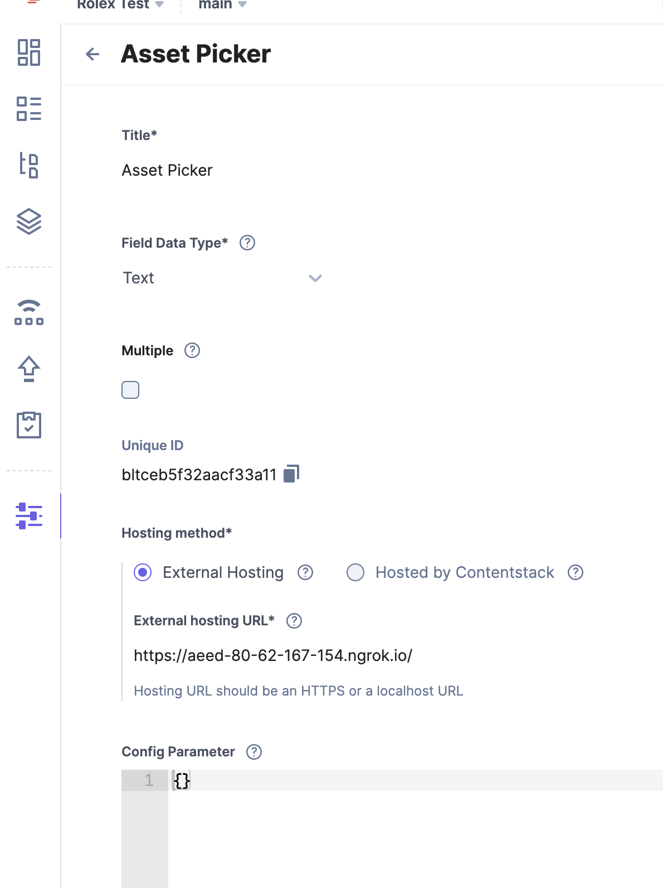

# Contentstack Asset picker

## Instructions
* Install the dependencies using `pnpm`
* Run the solution locally using `pnpm dev`

## Testing it locally
* As Contentstack recommends, please run `ngrok http 5173` to create a reverse proxy to your local environment and configure the public url in the extension settings

## Deploying the solution
* `pnpm build` 
* The build is generated on the `dist` folder

The extension configuration should look like this:
